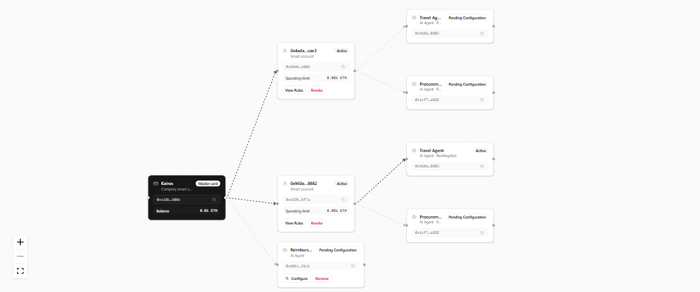

# Allocard

[](https://allocard.vercel.app/)
[](https://sepolia.basescan.org/)
[](https://metamask.io/)

---

## Quick Summary

Corporate expense card providers like Brex and Ramp allow companies to issue their employees credit cards for business expenses with predefined rules and spending controls. 

Allocard replicates this system with improvements. Using MetaMask's delegation features, we don't need to give employees direct access to funds. Instead, the company has a master smart account that holds all the expense funds. We then delegate funds to employees, which they can only spend under certain rules (caveats).

Allocard takes it a step further with the use of MetaMask's redelegation. We empower employees with AI agents (powered by Venice AI and smart accounts) built for specific expenses like travel and procurement. Employees can choose an agent that fits their expense need and redelegate the funds they received from the company to that agent to sort out the expense (e.g., the agent automatically books a flight).

Finally, Allocard has a fallback reimbursement agent that allows employees to get refunded if they paid for any expenses out of their own pockets. The company delegates funds to the agent's smart account, and the employee uploads their receipt. Venice AI uses its image-capable models to extract information from the receipt, and if it matches the company's policy, the employee gets refunded.

Using MetaMask Smart Account ERC-7710 delegation, redelegation features, and Venice AI, Allocard replicates and improves on the current state of corporate expense card systems.

---

## Table of Contents
- [The Problem with Corporate Expense Cards](#the-problem-with-corporate-expense-cards)
- [What Allocard Does Differently](#what-allocard-does-differently)
- [How It Works](#how-it-works)
- [MetaMask Delegation ERC-7710 Implementation](#metamask-delegation-erc-7710-implementation)
- [Venice AI and the Agent System](#venice-ai-and-the-agent-system)
- [The Delegation Canvas](#the-delegation-canvas)
- [App Walkthrough](#app-walkthrough)
- [Hackathon Track Eligibility](#hackathon-track-eligibility)
- [Demo Tips](#demo-tips)
- [Tech Stack](#tech-stack)
- [Local Setup](#local-setup)
- [Architecture](#architecture)

---

## The Problem with Corporate Expense Cards

Modern corporate card platforms like Brex and Ramp manage five things: per-user spend limits, real-time transaction logging, receipt compliance, virtual cards per vendor, and reimbursements for out-of-pocket purchases. They work. But they enforce every one of those rules through a centralized provider.

The deeper problem is how the money moves. Corporate cards pre-load funds or credit lines. The employee has access to more money than any single transaction needs. If they break the rules, the money moves before anyone catches it. Audits find violations after the fact.

The same problem applies to AI agents. Giving an agent a funded wallet means the agent can spend freely. Nothing in the wallet itself stops it from exceeding its intended scope. The faster the agent acts, the worse the problem gets.


---

## What Allocard Does Differently

Allocard does not pre-load funds. It issues a **delegation**: a signed, on-chain permission that lets a delegatee spend from the delegator's smart account up to the limits defined in the delegation's caveats.

The Delegation Manager contract checks every caveat on each spend attempt. A transaction that exceeds any caveat rule reverts. Funds never move until a valid transaction passes every check.

This maps directly onto the corporate card feature set:

| Corporate Card Feature | Allocard Implementation |
|---|---|
| Per-user spending limit | `nativeTokenTransferAmount` caveat: lifetime ETH cap |
| Monthly allowance reset | `nativeTokenPeriodTransfer` caveat: recurring allowance |
| Per-transaction cap | `valueLte` caveat: maximum ETH per transaction |
| Merchant restrictions | `allowedTargets` caveat: whitelist of recipient addresses |
| Card cancellation | Delegation revocation: instant, cascades to all sub-delegations |
| Receipt compliance | Venice Vision OCR: receipt scanned and matched to claim |
| Reimbursement | Reimbursement Agent: autonomous ETH transfer after policy check |
| Virtual cards for agents | Agent delegations: each agent gets a scoped, revocable delegation |

The difference is that every rule in this table is enforced at the contract level. There is no provider to call, no support ticket to raise, and no override available to anyone outside the delegation chain.

---

## How It Works

### Delegations and Caveats

A delegation is a signed object:

```
{
  delegator:  <company smart account address>,
  delegatee:  <employee or agent smart account address>,
  caveats:    [array of spending rules],
  signature:  <delegator's EIP-712 signature>
}
```

Allocard uses six caveat types:

| Caveat | What It Enforces |
|---|---|
| `nativeTokenTransferAmount` | Lifetime cumulative ETH spending cap |
| `nativeTokenPeriodTransfer` | Recurring allowance, resets each period (hourly / daily / weekly / monthly) |
| `valueLte` | Maximum ETH per single transaction |
| `allowedTargets` | Whitelist of addresses that can receive funds |
| `redeemer` | Locks which address can redeem the delegation |
| `limitedCalls` | Maximum number of redemptions |

## MetaMask Delegation ERC-7710 Implementation

Allocard's corporate expense card system covers three fundamental spending modes: employees spending directly on business needs, agents spending on an employee's behalf, and employees getting reimbursed for out-of-pocket purchases. Allocard handles all three using ERC-7710 delegation and redelegation. Each mode maps to a distinct delegation pattern.

**Pattern 1: Company to Employee to Agent (Redelegation, Agent Executes)**

The employer creates a delegation from the company smart account to an employee's smart account. The employee then redelegates a subset of that authority to an AI agent's smart account. The agent receives an independent, scoped delegation and executes transactions on its own. The employee never needs to approve each individual spend. The agent only has access to what the employee chose to redelegate. The company's full budget is never exposed.

This covers planned business spending: travel bookings and software procurement.

```
Company Smart Account  (e.g. 1 ETH lifetime, monthly reset)
  |
  └── Employee Smart Account  (e.g. 0.2 ETH lifetime, 0.05 ETH/month)
        |
        └── Travel Agent Smart Account  (e.g. 0.1 ETH, flights and hotels only)
        |
        └── Procurement Agent Smart Account  (e.g. 0.05 ETH, approved vendors only)
```

**Pattern 2: Company to Agent to Employee (Delegation, Agent Pays Out)**

The employer creates a delegation directly from the company smart account to the Reimbursement Agent's smart account. The employee does not hold a delegation in this pattern. Instead, they submit a claim to the agent. The agent evaluates the claim, and if it passes, the agent redeems the company delegation and transfers ETH to the employee's wallet.

This covers reimbursements: employees who paid out of pocket and need to be paid back.

```
Company Smart Account  (e.g. 0.5 ETH lifetime for reimbursements)
  |
  └── Reimbursement Agent Smart Account
        |
        └── Pays out to Employee smart account on approved claims
```


**Pattern 3: Company to Employee, Employee Redeems Directly (Direct Spend)**
The employer creates a delegation from the company smart account to the employee's smart account. The employee redeems that delegation themselves, specifying a merchant address as the recipient. No new delegation is created. No agent holds the authority. The employee is the delegatee and the one executing the transaction.
This covers ad-hoc business purchases that the Travel or Procurement Agents do not handle: a one-off software license, a business meal, a conference ticket. Before the transaction executes, Venice AI checks the stated purpose against the company's expense policy. If Venice flags a violation, the employee sees the reason and decides whether to proceed.
```
Company Smart Account
  |
  └── Employee Smart Account  (holds delegation, redeems directly)
        |
        └── Sends to Merchant Address  (no sub-delegation created)
```

Revoking a parent delegation revokes every delegation in its subtree. An employer can revoke an employee's delegation in one action, and every agent that employee delegated to loses access simultaneously.

---

## Venice AI and the Agent System

Allocard's agents are not chat assistants. Each agent holds a smart account, receives a scoped delegation, and executes on-chain transactions. Together, they cover the core workflows of a corporate expense card.

### Venice AI as the Decision Layer

Before any agent executes a transaction, Venice AI serves as the intelligent decision layer, evaluating requests with complete privacy. Because corporate financial data and employee receipts are highly sensitive, using a privacy-first AI provider like Venice is not just a feature—it's a strict requirement for a viable corporate expense system. Venice ensures that no expense decisions or receipt images are ever stored or used for model training.

Venice receives a comprehensive three-layer policy context for every decision:
- **Layer 1: On-chain caveats** (hard numeric limits from the delegation)
- **Layer 2: Company expense policy** (natural language rules set by the employer)
- **Layer 3: Per-delegation rules** (e.g., "economy flights only" on a travel delegation)

Venice intelligently evaluates all three layers together and returns a clear pass or reject decision with written reasoning. This natural language reasoning works hand-in-hand with the on-chain smart contracts. If Venice approves a transaction but it would still exceed an on-chain caveat, the Delegation Manager contract will securely revert it. The smart contract strictly enforces math, while Venice intelligently enforces policy.

### Reimbursement Agent

Not every business expense can be paid in advance. Sometimes an employee pays out of their own pocket first and claims it back later. Traditional corporate card platforms handle this with a manual reimbursement flow: the employee submits a receipt, a finance team reviews it, and the company pays them back over days or weeks.

Allocard automates this entirely. The company creates a delegation directly to the Reimbursement Agent's smart account, allocating a reimbursement budget. When an employee submits a claim, no human reviews it. The agent does.

How it works:

1. The employee opens the Reimbursement Agent drawer and submits a claim: a description of the expense, the ETH amount, and an optional receipt image.
2. If a receipt is uploaded, `qwen3-vl-235b-a22b` scans the image and extracts the merchant name, total amount, and date.
3. `mistral-small-3-2-24b-instruct` reads the extracted receipt data alongside the claim description, the on-chain caveat limits, the company's expense policy, and any agent-specific rules. It returns a pass or reject decision with written reasoning.
4. If the claim passes, the agent's backend signer redeems the company-to-agent delegation on-chain and transfers ETH directly to the employee's wallet. No finance team involved. No delay.
5. The full audit record is stored: the Venice prompt, the reasoning, a confidence score, and the transaction hash.

The company sets the budget ceiling in the delegation's caveats. Venice decides whether the individual claim fits policy. The contract ensures the ETH moved matches what was approved.

### Pre-Spend Advisory

The Travel and Procurement Agents cover planned, recurring business expenses. But employees sometimes need to pay a merchant that no agent covers. A one-off software license, a business lunch, a conference ticket. For these cases, employees can transfer ETH directly from their delegated smart account to any address.

Before that transfer executes, Allocard runs a policy check. The employee enters the recipient address, the ETH amount, and a short description of the purpose. `mistral-small-3-2-24b-instruct` reads that description against the company's expense policy and returns a verdict with reasoning.

The check is advisory. If Venice flags a policy violation, the employee sees the reason and can choose to cancel or proceed. If they proceed, the transaction is flagged in the employer's activity log for review. This gives employees flexibility while preserving a full audit trail for the employer.

### Travel Agent

Business travel is one of the largest uncontrolled expense categories for companies. An employee might book flights on a personal card and expense them later, or have a company card with no real guardrails on what they book.

With Allocard, an employee redelegates a portion of their budget to the Travel Agent's smart account. The caveats on that delegation define the exact budget available. The employee then opens the Travel Agent drawer and submits a travel request: destination, departure date, return date, and any specific requirements.

`mistral-small-3-2-24b-instruct` reads the request alongside the caveat limits and company policy. It researches flight and hotel options, selects the best fit within the budget, and returns a proposed itinerary with an estimated ETH cost. The employee reviews the itinerary and clicks Approve.

On approval, the agent's backend signer redeems the employee-to-agent delegation and executes the payment. The employee never had to touch the company's full budget. The agent only had access to what the employee delegated to it.

### Procurement Agent

Teams buy software subscriptions regularly. Without central visibility, companies end up with overlapping tools, duplicate subscriptions, and vendors that were never properly approved.

The Procurement Agent addresses this. An employee redelegates a procurement budget to the agent and opens the Procurement Agent drawer. They specify the tool category (e.g. project management, design, analytics), the team size, and any additional requirements.

`mistral-small-3-2-24b-instruct` receives the request and the list of tools the company already subscribes to. It checks for duplicates first. If the requested category is already covered by an existing tool, it flags this. If no duplicate exists, it researches vendors, compares pricing against the delegation budget, and returns a recommendation with estimated monthly ETH cost.

On employee approval, the agent redeems the delegation and executes the purchase. The employer sees the full activity in the delegation tree and can revoke the agent's delegation at any time.

---

## The Delegation Canvas



The delegation canvas is the primary interface for both the employer and the employee. It renders the delegation tree as a live graph using React Flow. Every node on the canvas represents a smart account. Every edge represents an active or pending delegation between two accounts.

### Employer Canvas

The employer's canvas shows the full company delegation tree. It is the employer's view of all spending authority they have issued.

The root node is the company's master smart account. It sits on the left side of the canvas. Delegation edges branch to the right, with employee nodes and agent nodes arranged as children.

**What each node shows:**
- The account name or wallet address
- The smart account address (with a one-click copy button)
- Delegation status: Active, Pending Configuration, or Revoked
- The spending limit on active delegations

**What the employer can do from the canvas:**
- Drag an employee from the sidebar and drop them onto the canvas to start a new delegation
- Click **Configure** on a pending node to open the caveat drawer and set spending rules
- Click **View Rules** on an active node to inspect the current caveats
- Click **Revoke** on any active node to revoke that delegation and all delegations in its subtree

The employer can also see agent nodes that employees created through redelegation. These appear as child nodes branching from the employee node. They are read-only on the employer canvas because the employer's smart account did not sign them. The employer can still see them and can revoke the parent employee delegation to remove access at that level.

Active delegation edges animate to show that spending authority is live. Revoked nodes appear faded. Pending nodes appear with a dashed edge.

### Employee Canvas

The employee's canvas shows their own spending authority and what they have delegated to agents.

The root node is the employee's own smart account. It shows the employee's approved spending limit from the company and the company name. Agent nodes branch to the right, one for each agent the employee has created a delegation for.

**What the employee can do from the canvas:**
- Drag an agent from the sidebar and drop it onto the canvas to start a new redelegation
- Click **Configure** on a pending agent node to set child caveats
- Click the action button on an active agent node to open that agent's drawer (e.g. **Book Trip** for the Travel Agent, **Claim** for the Reimbursement Agent, **Procure** for the Procurement Agent)
- Click **Revoke** on any active agent node to revoke that redelegation

The employee cannot see the employer's full company tree. They only see their own account and the agents they have delegated to.

---

## App Walkthrough

The employer and employee flows are not independent. The employer generates an invite link first. The employee must accept it and activate their smart account before the employer can issue a delegation to them. The walkthrough below follows the correct order.

### Step 1: Employer Setup

1. Open [allocard.vercel.app](https://allocard.vercel.app) in a normal browser window.
2. Connect a wallet via MetaMask Embedded Wallets.
3. Create a company. Enter a company name and submit.
4. Activate the company smart account. This deploys an ERC-4337 contract on Base Sepolia.
5. In the sidebar, generate an invite link. Copy it.

At this point, no employees appear on the canvas yet. The employer cannot issue a delegation until an employee exists in the system.

### Step 2: Employee Onboarding

Open a separate browser context to avoid sharing the wallet session. See the Demo Tips section below for options.

1. Paste the invite link into the second browser context and open it.
2. Authenticate with a different wallet via MetaMask Embedded Wallets.
3. The app links the wallet to the company and creates an employee record.
4. Activate the employee smart account from the dashboard banner. This deploys a second ERC-4337 contract.

The employee now appears in the employer's sidebar.

### Step 3: Employer Issues a Delegation

Switch back to the employer window.

1. The employee now appears in the sidebar under Recipients.
2. Drag the employee node from the sidebar onto the canvas.
3. Click **Configure** on the new pending node.
4. Set the spending rules: lifetime limit, optional recurring allowance, per-transaction cap, and allowed addresses.
5. Click **Activate Delegation**. The MetaMask Smart Accounts Kit signs the delegation using the company smart account. It is stored in the database.
6. The node on the canvas updates to Active. The delegation edge animates.

The employee can now see their approved spending limit on their own canvas.

### Step 4: Employee Redelegates to an Agent

Switch back to the employee window.

1. The canvas now shows the inbound delegation from the company with the approved limit.
2. From the sidebar, drag an AI agent onto the canvas.
3. Click **Configure** on the new pending agent node.
4. Set child caveat values. Every field is capped at the parent delegation's limits.
5. Click **Sign and Activate Delegation**. The delegation is signed in the browser using the employee's smart account.

The employer can now see the agent node branching from the employee node on their canvas.

### Step 5: Agent Execution

**Reimbursement claim:**

1. On the employee canvas, click **Claim** on the Reimbursement Agent node.
2. Enter an expense description, ETH amount, and optionally upload a receipt image.
3. Submit the claim. Venice Vision scans the receipt. Venice Text checks the claim against the policy.
4. If approved, the agent transfers ETH from the company smart account to the employee's wallet.

**Travel or Procurement request:**

1. Click **Book Trip** on the Travel Agent node, or **Procure** on the Procurement Agent node.
2. Enter the request details.
3. Venice returns a proposed itinerary or vendor recommendation.
4. Click **Approve**. The agent redeems the delegation and executes the on-chain payment.

**Direct spend:**

1. Open the Wallet and Direct Spend tab on the employee dashboard.
2. Enter a recipient address, ETH amount, and purpose.
3. Click **Review Spend**. Venice evaluates the purpose against company policy.
4. Review the Venice verdict and proceed or cancel. If you proceed despite a flag, the transaction is logged for employer review.

---


## Hackathon Track Eligibility

| Track | Status | Evidence |
|---|---|---|
| **Best A2A Coordination** | Eligible | Allocard implements two delegation patterns. In the first, a Company delegates to an Employee, who redelegates a subset to an AI Agent (Travel or Procurement). In the second, the Company delegates directly to the Reimbursement Agent, and the agent pays out to the Employee. All entities hold ERC-4337 smart accounts. Both patterns use ERC-7710 redelegation. |
| **Best Agent** | Eligible | Allocard's agent system automates the core workflows of a corporate expense card: planned business spending via the Travel and Procurement Agents, and out-of-pocket expenses via the Reimbursement Agent. (Note: Direct ad-hoc spending is handled directly by employees, not agents). Each agent holds a smart account, receives a scoped delegation, evaluates the request with Venice AI, and executes the on-chain transaction autonomously. No human approves individual transactions. |
| **Best Use of Venice AI** | Eligible | Venice AI acts as the decision layer across every agent and spend flow. It reads on-chain caveats and natural language policy together, then makes a pass or reject decision. It also performs receipt OCR. Two models are used: `mistral-small-3-2-24b-instruct` for policy reasoning and `qwen3-vl-235b-a22b` for vision. All decisions are stateless and private. |

---

## Demo Tips

### Testing Both Roles at the Same Time

MetaMask Embedded Wallets stores the session in browser `localStorage`. Two tabs in the same browser window share the same wallet. To run employer and employee accounts simultaneously, use separate browser contexts:

| Setup | How |
|---|---|
| Normal window + Incognito window (easiest) | Employer in the normal window, employee in an Incognito or Private window. Each has its own isolated `localStorage`. |
| Two browser profiles | Chrome Profile 1 for employer, Chrome Profile 2 for employee. |
| Two different browsers | Employer in Chrome, employee in Firefox. |

Recommended for judges: open the employer dashboard in a normal browser window, then open the employee invite link in an Incognito window and authenticate with a different account. Both sessions run with no interference.

---


## Tech Stack

| Layer | Technology |
|---|---|
| Framework | Next.js 15, React 19 |
| UI | shadcn/ui, React Flow, Tailwind CSS |
| Blockchain | MetaMask Smart Accounts Kit (ERC-7710, ERC-4337), Viem |
| AI | Venice AI: `mistral-small-3-2-24b-instruct`, `qwen3-vl-235b-a22b` |
| Auth | MetaMask Embedded Wallets |
| Database | Neon (Postgres), Drizzle ORM |
| Deployment | Vercel, Base Sepolia testnet |
| Package Manager | pnpm (monorepo) |

---

## Local Setup

**Prerequisites:** Node.js 20+, pnpm 9+, MetaMask browser extension.

Create `apps/web/.env.local`:

```env
VENICE_API_KEY=your_venice_api_key
NEXT_PUBLIC_METAMASK_APP_ID=your_metamask_app_id
DATABASE_URL=your_neon_postgres_connection_string
```

Install and run:

```bash
pnpm install
cd apps/web
pnpm dev
```

Open [http://localhost:3000](http://localhost:3000).

---

## Architecture

```
Browser
  MetaMask Embedded Wallets (auth)
  MetaMask Smart Accounts Kit (signing)
  React Flow (delegation canvas)
        |
Next.js App Router
  /employer     Employer dashboard, delegation management
  /employee     Employee dashboard, redelegation, agent picker
  /api/agents   Agent execution (reimbursement, travel, procurement)
  /api/wallet   Direct spend and pre-spend policy check
        |
 ┌──────────────────────────┐    ┌─────────────────────────────────┐
 │   Neon Postgres           │    │   Venice AI                     │
 │   Drizzle ORM             │    │   mistral-small-3-2-24b-instruct│
 │   Delegation records      │    │   qwen3-vl-235b-a22b            │
 │   Audit trail             │    └─────────────────────────────────┘
 └──────────────────────────┘
        |
Delegation Manager Contract (Base Sepolia)
  ERC-7710 delegation validation
  Caveat enforcer execution
  On-chain ETH transfer
```

---


*Built for the MetaMask Smart Accounts Kit x 1Shot API Hackathon. Network: Base Sepolia. Standards: ERC-7710, ERC-4337.*
